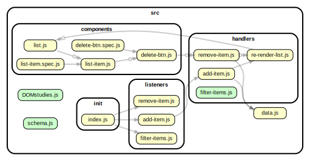

<!-- BEGIN TITLE -->

# DOCS

<!-- END TITLE -->

<!-- BEGIN TREE -->

<!-- END TREE -->

<!-- BEGIN TOC -->

- handlers
  - [add-item.js](#srchandlersadd-itemjs)
  - [filter-items.js](#srchandlersfilter-itemsjs)
  - [remove-item.js](#srchandlersremove-itemjs)
- init
  - [index.js](#srcinitindexjs)
- listeners
  - [add-item.js](#srclistenersadd-itemjs)
  - [filter-items.js](#srclistenersfilter-itemsjs)
  - [remove-item.js](#srclistenersremove-itemjs)
- logic
- procedures
- [DOMstudies.js](#srcDOMstudiesjs)
- [data.js](#srcdatajs)

<!-- END TOC -->

<!-- BEGIN DOCS -->

---

# /handlers

<a href="../src/handlers/add-item.js" id="srchandlersadd-itemjs">src/handlers/add-item.js</a>

<a href="../src/handlers/filter-items.js" id="srchandlersfilter-itemsjs">src/handlers/filter-items.js</a>

<a href="../src/handlers/remove-item.js" id="srchandlersremove-itemjs">src/handlers/remove-item.js</a>

---

[TOP](#DOCS)

---

# /init

<a href="../src/init/index.js" id="srcinitindexjs">src/init/index.js</a>

---

[TOP](#DOCS)

---

# /listeners

<a href="../src/listeners/add-item.js" id="srclistenersadd-itemjs">src/listeners/add-item.js</a>

<a href="../src/listeners/filter-items.js" id="srclistenersfilter-itemsjs">src/listeners/filter-items.js</a>

<a href="../src/listeners/remove-item.js" id="srclistenersremove-itemjs">src/listeners/remove-item.js</a>

---

[TOP](#DOCS)

---

# /logic

---

[TOP](#DOCS)

---

# /procedures

---

[TOP](#DOCS)

<a href="../src/DOMstudies.js" id="srcDOMstudiesjs">src/DOMstudies.js</a>

<a href="../src/data.js" id="srcdatajs">src/data.js</a>

<!-- END DOCS -->
