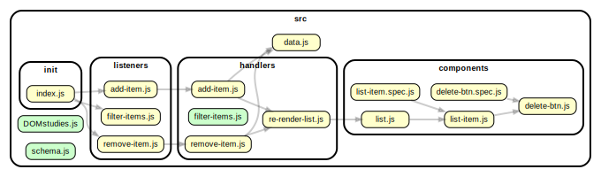

<!-- BEGIN TITLE -->

# DOCS

<!-- END TITLE -->

<!-- BEGIN TREE -->

<!-- END TREE -->

<!-- BEGIN TOC -->

- components
  - [list-item.js](#srccomponentslist-itemjs)
  - [list.js](#srccomponentslistjs)
- handlers
  - [add-item.js](#srchandlersadd-itemjs)
  - [filter-items.js](#srchandlersfilter-itemsjs)
  - [remove-item.js](#srchandlersremove-itemjs)
- init
  - [index.js](#srcinitindexjs)
- listeners
  - [add-item.js](#srclistenersadd-itemjs)
  - [filter-items.js](#srclistenersfilter-itemsjs)
  - [remove-item.js](#srclistenersremove-itemjs)
- logic
- procedures
- [DOMstudies.js](#srcDOMstudiesjs)
- [data.js](#srcdatajs)
- [schema.js](#srcschemajs)

<!-- END TOC -->

<!-- BEGIN DOCS -->

---

# /components

<a href="../src/components/list-item.js" id="srccomponentslist-itemjs">src/components/list-item.js</a>

## listItem ⇒ <code>Element</code>

renders a single item element

**Returns**: <code>Element</code> - <li> item with text, checkbox and button.

| Param | Type                | Description                       |
| ----- | ------------------- | --------------------------------- |
| item  | <code>object</code> | object from array items (data.js) |

<a href="../src/components/list.js" id="srccomponentslistjs">src/components/list.js</a>

## list ⇒ <code>Element</code>

renders a list with all added elements

**Returns**: <code>Element</code> - <ul> new list

| Param | Type               | Description           |
| ----- | ------------------ | --------------------- |
| array | <code>Array</code> | text of all the items |

---

[TOP](#DOCS)

---

# /handlers

<a href="../src/handlers/add-item.js" id="srchandlersadd-itemjs">src/handlers/add-item.js</a>

<a href="../src/handlers/filter-items.js" id="srchandlersfilter-itemsjs">src/handlers/filter-items.js</a>

<a href="../src/handlers/remove-item.js" id="srchandlersremove-itemjs">src/handlers/remove-item.js</a>

---

[TOP](#DOCS)

---

# /init

<a href="../src/init/index.js" id="srcinitindexjs">src/init/index.js</a>

---

[TOP](#DOCS)

---

# /listeners

<a href="../src/listeners/add-item.js" id="srclistenersadd-itemjs">src/listeners/add-item.js</a>

<a href="../src/listeners/filter-items.js" id="srclistenersfilter-itemsjs">src/listeners/filter-items.js</a>

<a href="../src/listeners/remove-item.js" id="srclistenersremove-itemjs">src/listeners/remove-item.js</a>

---

[TOP](#DOCS)

---

# /logic

---

[TOP](#DOCS)

---

# /procedures

---

[TOP](#DOCS)

<a href="../src/DOMstudies.js" id="srcDOMstudiesjs">src/DOMstudies.js</a>

<a href="../src/data.js" id="srcdatajs">src/data.js</a>

<a href="../src/schema.js" id="srcschemajs">src/schema.js</a>

<!-- END DOCS -->
